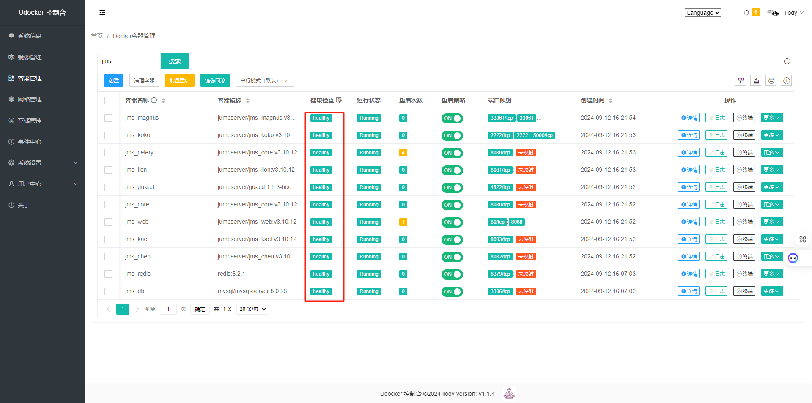
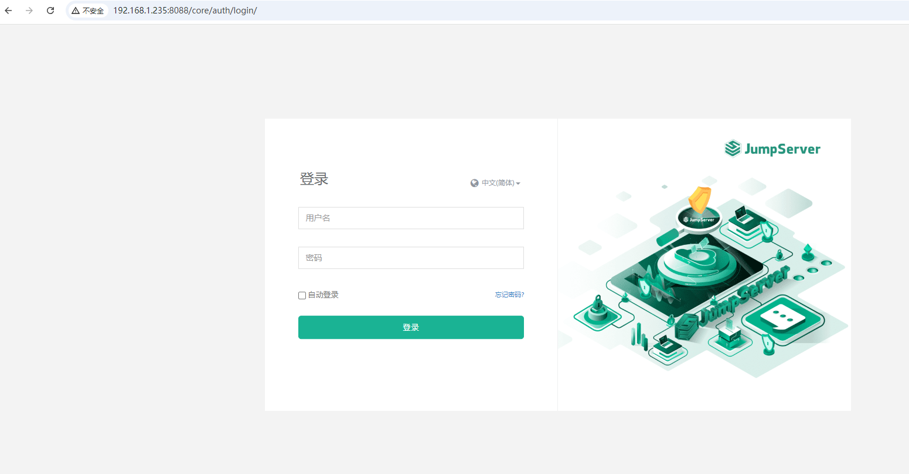
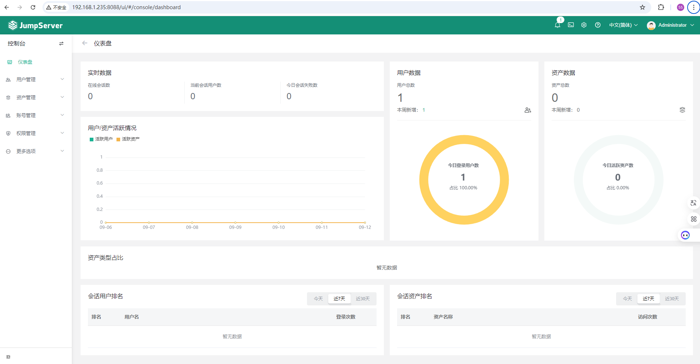

## Docker-compose部署jumpserver:v3.10.12

### 简介

> JumpServer 堡垒机帮助企业以更安全的方式管控和登录各种类型的**资产**。

### 地址

> 官网地址：https://www.jumpserver.org/index.html

### 环境要求

#### 操作系统

| 架构    | Linux 内核 | 软件要求                              | 最小化硬件配置        |
| ------- | ---------- | ------------------------------------- | --------------------- |
| x86_64  | >=4.0      | wget curl tar gettext iptables python | 2Core/8GB RAM/60G HDD |
| aarch64 | >=4.0      | wget curl tar gettext iptables python | 2Core/8GB RAM/60G HDD |

#### 数据库要求

| 名称  | 版本  | 建议   |
| ----- | ----- | ------ |
| MySQL | >=5.7 | 8.0+   |
| Redis | >=6.0 | 6.2.1+ |

### 生成密钥

```bash
# 生成SECRET_KEY
[root@consul jumpserver]# cat /dev/urandom | tr -dc A-Za-z0-9 | head -c 50
qqOGA1cgJ4QP2CatFsCgfk34VDLKvA9XUu1jAxwgSh1hSMQteq

# 生成BOOTSTRAP_TOKEN
[root@consul jumpserver]# cat /dev/urandom | tr -dc A-Za-z0-9 | head -c 16
FypSKwmAIehBvmCH
```

### 创建变量文件

```bash
[root@consul jumpserver]# vim config_example.conf
```

```bash
# 版本号可以自己根据项目的版本修改
VERSION=v3.10.12

# 构建参数, 支持 amd64, arm64, ppc64le, s390x
TARGETARCH=amd64

# Compose, Swarm 模式下修改 NETWORK_DRIVER=overlay
#COMPOSE_PROJECT_NAME=jms
# COMPOSE_HTTP_TIMEOUT=3600
# DOCKER_CLIENT_TIMEOUT=3600
#DOCKER_SUBNET=192.168.250.0/24
#NETWORK_DRIVER=bridge

# 持久化存储
VOLUME_DIR=/opt/jumpserver

# 时区
TZ=Asia/Shanghai

# MySQL
DB_HOST=jms_db
DB_PORT=3306
DB_USER=jumpserver
DB_PASSWORD=nu4x599Wq7u0Bn8EABh3J91G
DB_NAME=jumpserver
DB_ROOT_PASSWORD=nu4x599Wq7u0Bn8EABh3J91G

# Redis
REDIS_HOST=jms_redis
REDIS_PORT=6379
REDIS_PASSWORD=8URXPL2x3HZMi7xoGTdk3Upj

# Core
SECRET_KEY=qqOGA1cgJ4QP2CatFsCgfk34VDLKvA9XUu1jAxwgSh1hSMQteq
BOOTSTRAP_TOKEN=FypSKwmAIehBvmCH
LOG_LEVEL=ERROR
DOMAINS=

# Lion
GUA_HOST=guacd
GUA_PORT=4822

# Web
HTTP_PORT=8088
SSH_PORT=2222
MAGNUS_MYSQL_PORT=33061
MAGNUS_MARIADB_PORT=33062
MAGNUS_REDIS_PORT=63790

##
# SECRET_KEY 保护签名数据的密匙, 首次安装请一定要修改并牢记, 后续升级和迁移不可更改, 否则将导致加密的数据不可解密。
# BOOTSTRAP_TOKEN 为组件认证使用的密钥, 仅组件注册时使用。组件指 koko, lion, magnus, kael, chen ...
```

### 拷贝文件

```bash
[root@consul jumpserver]# cp config_example.conf .env 
cp：是否覆盖".env"？ y
```

> 此文件名与docker-compase文件中的值对应。

### 创建网络命名空间

```bash
[root@consul jumpserver]#  docker network create jumpserver
```

### 创建数据库编排文件

```bash
[root@consul jumpserver]#  vim db.yml
```

```yaml
version: '3.4'
services:
  jms_db:
    container_name: jms_db
    image: mysql/mysql-server:8.0.26
    restart: always
    tty: true
    volumes:
      - /etc/localtime:/etc/localtime
      - ${VOLUME_DIR}/mysql:/var/lib/mysql
    environment:
      TZ: Asia/Shanghai
      MYSQL_ROOT_PASSWORD: ${DB_ROOT_PASSWORD}
      MYSQL_USER: ${DB_USER}
      MYSQL_PASSWORD: ${DB_PASSWORD}
      MYSQL_DATABASE: ${DB_NAME}
    command: --character-set-server=utf8 --collation-server=utf8_general_ci --default-authentication-plugin=mysql_native_password --skip-name-resolve
    networks:
      - jumpserver

  jms_redis:
    container_name: jms_redis
    image: redis:6.2.1
    restart: always
    command: redis-server --requirepass $REDIS_PASSWORD --loglevel warning --maxmemory-policy allkeys-lru
    depends_on:
      - jms_db
    environment:
      REDIS_PORT: $REDIS_PORT
      REDIS_PASSWORD: $REDIS_PASSWORD
    healthcheck:
      test: ["CMD-SHELL", "redis-cli -a ${REDIS_PASSWORD} ping | grep PONG"]
      interval: 10s
      timeout: 5s
      retries: 3
      start_period: 30s
    volumes:
      - ${VOLUME_DIR}/redis:/data
    networks:
      - jumpserver
networks:
  jumpserver:
    external: true
    # name: jumpserver
```

#### 部署

```bash
[root@consul jumpserver]# docker-compose -p db -f db.yml up -d
Creating jms_db ... done
Creating jms_redis ... done
[root@consul jumpserver]# docker-compose -p db -f db.yml ps -a
  Name                 Command                  State                   Ports   
------------------------------------------------------------------------------------------
jms_db      /entrypoint.sh --character ...   Up (healthy)   3306/tcp, 33060/tcp, 33061/tcp
jms_redis   docker-entrypoint.sh redis ...   Up (healthy)   6379/tcp   
```

### 创建**Docker-compose**编排文件

```bash
[root@consul jumpserver]#  vim docker-compose.yml
```

```yaml
version: '3.4'
services:
  core:
    image: jumpserver/jms_core:${VERSION}
    container_name: jms_core
    hostname: core
    restart: always
    command: start web
    env_file: .env
    healthcheck:
      test: "check http://localhost:8080/api/health/"
      interval: 10s
      timeout: 5s
      retries: 3
      start_period: 90s
    volumes:
      - ${VOLUME_DIR}/core/data:/opt/jumpserver/data
    networks:
      - jumpserver

  celery:
    image: jumpserver/jms_core:${VERSION}
    container_name: jms_celery
    hostname: celery
    restart: always
    command: start task
    env_file: .env
    depends_on:
      - core
    healthcheck:
      test: "bash /opt/jumpserver/utils/check_celery.sh"
      interval: 10s
      timeout: 5s
      retries: 3
      start_period: 30s
    volumes:
      - ${VOLUME_DIR}/core/data:/opt/jumpserver/data
    networks:
      - jumpserver

  koko:
    image: jumpserver/jms_koko:${VERSION}
    container_name: jms_koko
    hostname: koko
    restart: always
    privileged: true
    env_file: .env
    tty: true
    environment:
      CORE_HOST: http://core:8080
      BOOTSTRAP_TOKEN: $BOOTSTRAP_TOKEN
      LOG_LEVEL: $LOG_LEVEL
    depends_on:
      - core
    healthcheck:
      test: "check http://localhost:5000/koko/health/"
      interval: 10s
      timeout: 5s
      retries: 3
      start_period: 10s
    volumes:
      - ${VOLUME_DIR}/koko/data:/opt/koko/data
    ports:
      - ${SSH_PORT:-2222}:${SSH_PORT:-2222}
    networks:
      - jumpserver

  guacd:
    image: jumpserver/guacd:1.5.3-bookworm
    container_name: jms_guacd
    hostname: guacd
    restart: always
    user: root
    environment:
      TZ: ${TZ:-Asia/Shanghai}
      GUACD_LOG_LEVEL: ${GUACD_LOG_LEVEL:-error}
    volumes:
      - ${VOLUME_DIR}/lion/data:/opt/lion/data
    networks:
      - jumpserver

  lion:
    image: jumpserver/jms_lion:${VERSION}
    container_name: jms_lion
    hostname: lion
    restart: always
    env_file: .env
    tty: true
    environment:
      CORE_HOST: http://core:8080
      BOOTSTRAP_TOKEN: $BOOTSTRAP_TOKEN
      LOG_LEVEL: $LOG_LEVEL
    depends_on:
      - core
    healthcheck:
      test: "check http://localhost:8081/lion/health/"
      interval: 10s
      timeout: 5s
      retries: 3
      start_period: 10s
    volumes:
      - ${VOLUME_DIR}/lion/data:/opt/lion/data
    networks:
      - jumpserver

  magnus:
    image: jumpserver/jms_magnus:${VERSION}
    container_name: jms_magnus
    hostname: magnus
    restart: always
    tty: true
    environment:
      CORE_HOST: http://core:8080
      BOOTSTRAP_TOKEN: $BOOTSTRAP_TOKEN
      LOG_LEVEL: $LOG_LEVEL
    depends_on:
      - core
    env_file: .env
    healthcheck:
      test: "check http://localhost:8088/health"
      interval: 10s
      timeout: 5s
      retries: 3
      start_period: 10s
    volumes:
      - ${VOLUME_DIR}/magnus/data:/opt/magnus/data
    ports:
      - ${MAGNUS_MYSQL_PORT:-33061}:33061
      - ${MAGNUS_MARIADB_PORT:-33062}:33062
      - ${MAGNUS_REDIS_PORT:-63790}:63790
    networks:
      - jumpserver

  chen:
    image: jumpserver/jms_chen:${VERSION}
    container_name: jms_chen
    hostname: chen
    restart: always
    env_file: .env
    environment:
      CORE_HOST: http://core:8080
      BOOTSTRAP_TOKEN: $BOOTSTRAP_TOKEN
      LOG_LEVEL: $LOG_LEVEL
    volumes:
      - ${VOLUME_DIR}/chen/data:/opt/chen/data
    healthcheck:
      test: "check http://localhost:8082/chen"
      interval: 10s
      timeout: 5s
      retries: 3
      start_period: 60s
    networks:
      - jumpserver

  kael:
    image: jumpserver/jms_kael:${VERSION}
    container_name: jms_kael
    hostname: kael
    restart: always
    env_file: .env
    environment:
      CORE_HOST: http://core:8080
      BOOTSTRAP_TOKEN: $BOOTSTRAP_TOKEN
      LOG_LEVEL: $LOG_LEVEL
    volumes:
      - ${VOLUME_DIR}/kael/data:/opt/kael/data
    healthcheck:
      test: "check http://localhost:8083/kael/health/"
      interval: 10s
      timeout: 5s
      retries: 3
      start_period: 60s
    networks:
      - jumpserver

  web:
    image: jumpserver/jms_web:${VERSION}
    container_name: jms_web
    hostname: web
    restart: always
    env_file: .env
    healthcheck:
      test: "check http://localhost/api/health/"
      interval: 10s
      timeout: 5s
      retries: 3
      start_period: 10s
    volumes:
      - ${VOLUME_DIR}/core/data:/opt/jumpserver/data
      - ${VOLUME_DIR}/web/data/logs:/var/log/nginx
      - ${VOLUME_DIR}/web/download:/opt/download
    ports:
      - ${HTTP_PORT:-80}:80
    networks:
      - jumpserver

networks:
  jumpserver:
    external: true
    # name: jumpserver

```

#### 部署

```bash
[root@consul jumpserver]# docker-compose -p jumpserver -f docker-compose.yml up -d
Creating jms_kael  ... done
Creating jms_web    ... done
Creating jms_guacd  ... done
Creating jms_core  ... done
Creating jms_chen   ... done
Creating jms_lion   ... done
Creating jms_koko   ... done
Creating jms_celery ... done
Creating jms_magnus ... done
[root@consul jumpserver]# docker-compose -p jumpserver -f docker-compose.yml ps -a
   Name                 Command                  State                                          Ports                            
-----------------------------------------------------------------------------------------------------------------------------------------
jms_celery   /opt/entrypoint.sh start task    Up (healthy)   8080/tcp                                                            
jms_chen     /opt/entrypoint.sh wisp          Up (healthy)   8082/tcp                                                            
jms_core     /opt/entrypoint.sh start web     Up (healthy)   8080/tcp                                                            
jms_guacd    /bin/sh -c /opt/guacamole/ ...   Up (healthy)   4822/tcp                                                            
jms_kael     /opt/entrypoint.sh wisp          Up (healthy)   8083/tcp                                                            
jms_koko     /opt/entrypoint.sh wisp          Up (healthy)   0.0.0.0:2222->2222/tcp, 5000/tcp                                    
jms_lion     /opt/entrypoint.sh wisp          Up (healthy)   8081/tcp                                                            
jms_magnus   /opt/entrypoint.sh wisp          Up (healthy)   0.0.0.0:33061->33061/tcp, 0.0.0.0:33062->33062/tcp, 0.0.0.0:63790->63790/tcp
jms_web      /docker-entrypoint.sh ngin ...   Up (healthy)   0.0.0.0:8088->80/tcp  
```

> 容器健康状态**healthy**后方为部署成功。

### Docker管理面板查看容器状态



### 访问测试

> 地址: http://<JumpServer服务器IP地址>:<服务运行端口>
>
> 默认账户：admin
>
> 默认密码：admin




